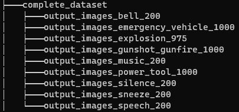

# Undergraduate Thesis
- This repository contains every relevant file that was used to achieve the objective of training an ML model with audio from [Audioset Dataset](https://research.google.com/audioset/dataset/index.html).

- This repository does not include the files required to download the dataset; for that, please visit [audioset-processing](https://github.com/aoifemcdonagh/audioset-processing/pull/11).
## Input File Structure
To run [`populate_dataset.py`](https://github.com/Jeremias-V/audioset_thesis/blob/main/populate_dataset.py) you need to have the input directory as the following image:

Each subfolder contains the preprocessed image in `.png` format that was obtained with [`thesis_preprocessing.ipynb`](https://github.com/Jeremias-V/audioset_thesis/blob/main/thesis_preprocessing.ipynb).
